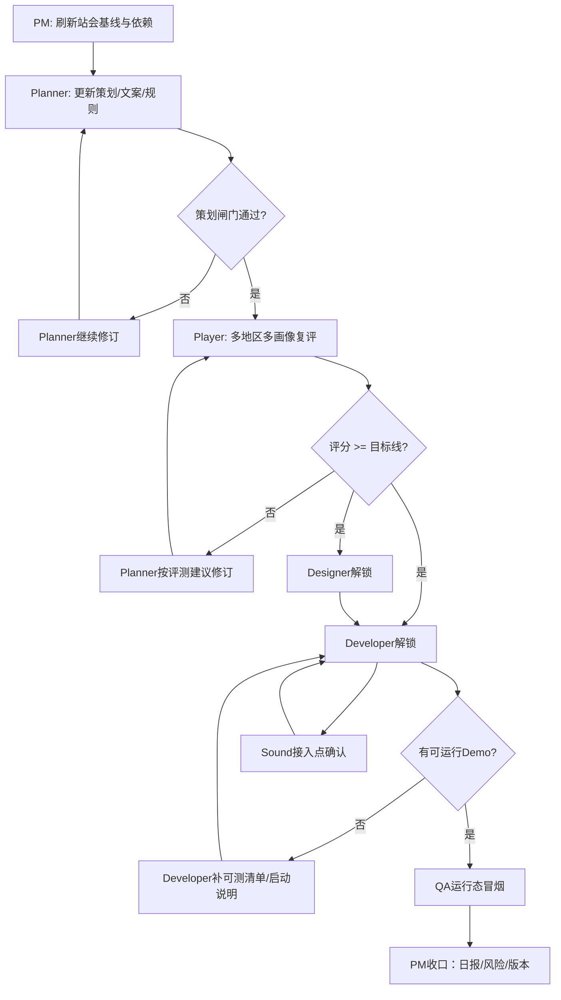

# 多角色人工串行工作流重构方案

## 目标

将原先的“后台 cron 并发多角色任务”改造为“主会话人工串行执行的多角色工作流”，确保：

- 角色上下文隔离
- 输出文件隔离
- 阶段门清晰
- 不再因并发写入、投递失败、计费波动而污染产物

## 新工作流总图

## 串行执行顺序

### 第一层：治理层
1. `pm`
2. `planner`
3. `player`

### 第二层：生产层（仅在评分过线或用户强制解锁时）
4. `designer`
5. `developer`
6. `qa`
7. `sound`

## 阶段门定义

### Gate-A：策划质量闸门
- 责任角色：`planner`
- 判定文件：`automation/checks/planner/gate_check.json`
- 通过条件：`passed == true`
- 未通过时：只允许 `pm/planner`

### Gate-B：玩家评分闸门
- 责任角色：`player`
- 判定文件：`work/player/score_report_v2.json`
- 当前目标：`>= 9.0`
- 冲刺目标：`>= 9.2`
- 未通过时：默认冻结 `designer/developer/qa/sound`，其中设计/开发/测试明确不启动

### Gate-C：可测闸门
- 责任角色：`developer` + `qa`
- 通过条件：
  - 有 demo
  - 有可测清单
  - 有启动步骤
  - 有版本标识
- 未通过时：`qa` 只做静态检查

## 单一事实源

- 里程碑目标：`work/planner/master_design.md`
- 排期与时间线：`work/pm/project_schedule.md`
- 玩家评分：`work/player/score_report_v2.json`
- 质量闸门：`automation/checks/planner/gate_check.json`
- 每日任务基线：`manual_workflow/standups/YYYY-MM-DD.md`

## 明确废除的旧模式

- 不再使用后台角色 cron 作为主执行机制
- 不再允许多个角色同时改写共享状态文件
- 不再把“消息投递成功”当成“任务执行成功”

## 当前建议执行链

当前最合理的人工串行链：

1. `pm`：刷新今天站会与当前风险
2. `planner`：补 `copy_deck_v1.md` 与叙事薄弱点
3. `player`：重新复评
4. 若评分仍 <8.0：回到 `planner`
5. 若评分 >=9.0：再解锁 `designer/developer/qa`，并视需要解锁 `sound`
